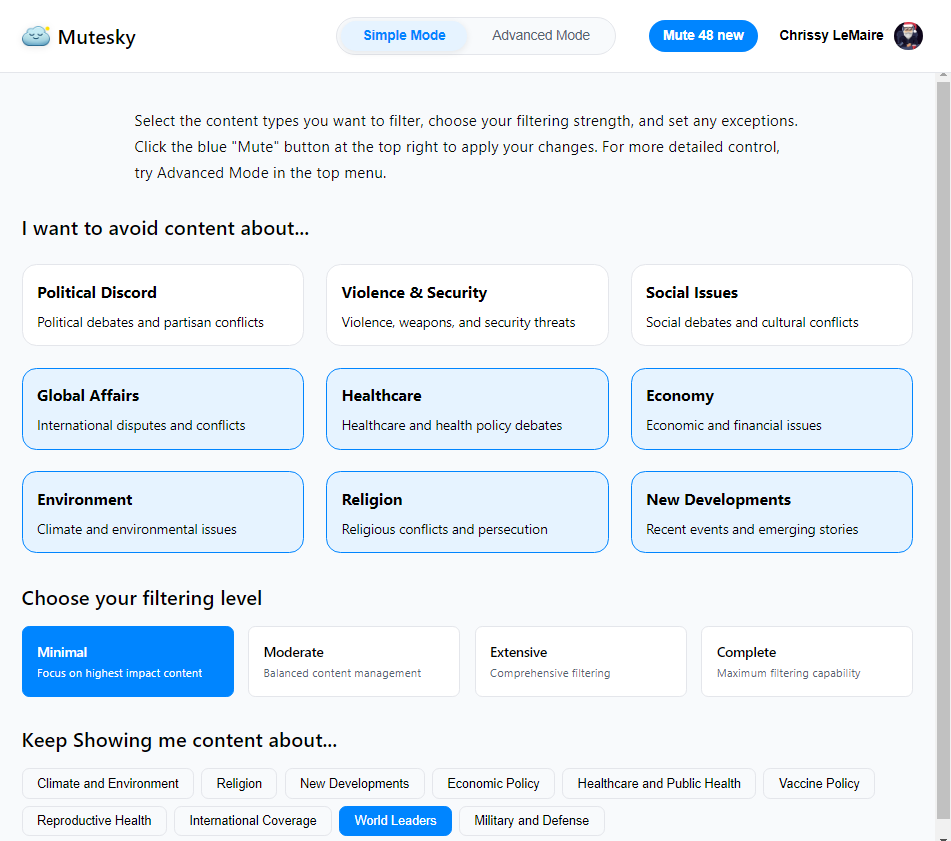
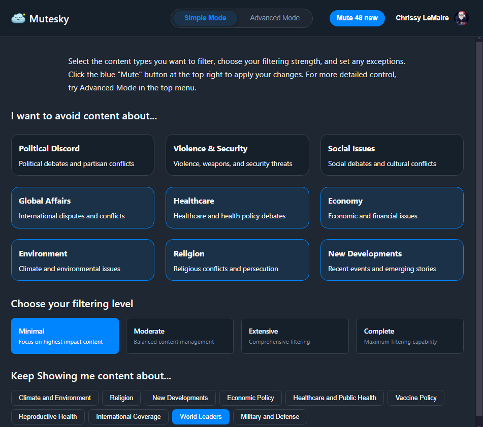
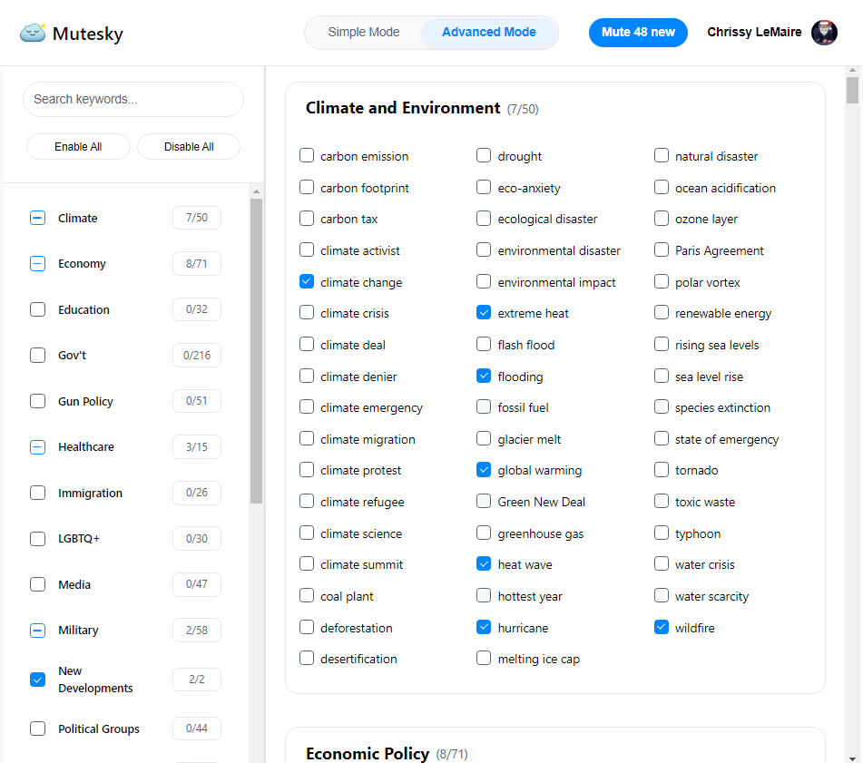
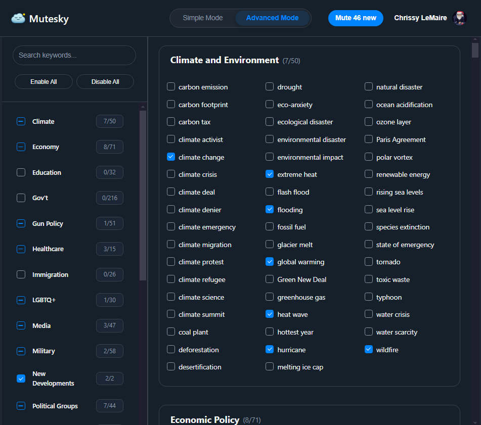
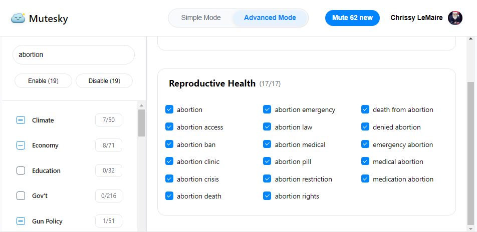
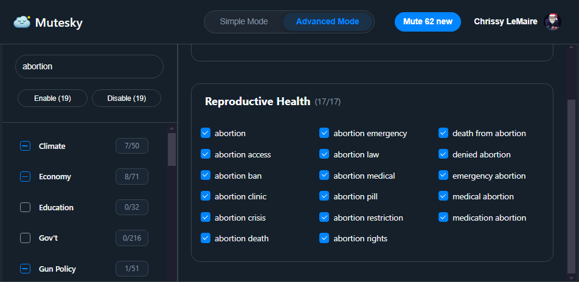

# MuteSky - Bulk manage Bluesky mutes with pre-populated keyword lists

  MuteSky is a web app that gives you granular control over what appears in your Bluesky feed through curated keyword collections. Working directly with Bluesky's native mute system, it provides an intuitive interface to filter out content you'd rather not see. With over 1,500 pre-populated keywords organized into 20+ smart categories, MuteSky makes content filtering both easy and effective.

&nbsp;

## 🌟 Key Features

- **Instant Setup**: Pre-populated with 1,500+ keywords, continuously updated by AI to reflect current events
- **Smart Categories**: 20+ organized topic groups covering:
  - Political Discord
  - Violence & Security
  - Social Issues
  - Global Affairs
  - Healthcare
  - Economy
  - Environment
  - Religion
  - New Developments
- **Two Ways to Filter**:
  - Simple Mode: Quick topic-based filtering with 4 strength levels
  - Advanced Mode: Fine-tune individual keywords
- **Smart Search**: Filter keywords to find related terms, then enable/disable them all at once or individually
- **Real-Time**: Changes hit your feed instantly
- **Zero Storage**: Works directly with Bluesky's mute system - we never store your data
- **Performance Optimized**: Smart warnings when approaching Bluesky's performance thresholds

## 🖼️ Screenshots

### Simple Mode
<div style="display: flex; gap: 10px;">
  
  
</div>

### Advanced Mode
<div style="display: flex; gap: 10px;">
  
  
</div>

### Smart Search
<div style="display: flex; gap: 10px;">
  
  
</div>

## 🚀 Get Started

1. Visit [mutesky.app](https://mutesky.app)
2. Sign in with your Bluesky account (ex. username.bsky.social)
3. Pick your topics or dive into keyword management
4. Click "Mute" to apply changes

## 📚 Documentation

Comprehensive documentation is available in the [docs](docs/README.md) directory:

### User Guides
- [Understanding Modes](docs/3-guides/1-understanding-modes.md) - Learn when to use Simple vs Advanced mode
- [Muting Explained](docs/3-guides/2-muting-explained.md) - How muting works with Bluesky
- [State Persistence](docs/3-guides/3-state-persistence.md) - Understanding saved changes

### Architecture
- [Core Concepts](docs/1-architecture/1-core-concepts.md) - System overview and state management
- [Authentication](docs/1-architecture/2-authentication.md) - OAuth and session handling
- [Muting System](docs/1-architecture/3-muting-system.md) - Keyword management and API integration
- [Mode System](docs/1-architecture/4-mode-system.md) - Simple/Advanced mode implementation
- [Performance](docs/1-architecture/5-performance.md) - Core optimizations
- [Click Performance](docs/1-architecture/6-click-performance.md) - UI responsiveness

### Development
- [Known Issues](docs/2-development/1-known-issues.md) - Common problems and solutions
- [Troubleshooting Guide](docs/2-development/2-troubleshooting-guide.md) - Debug common issues

## 👩‍💻 Developer Quick Start

### Tech Stack
- Frontend: Vanilla JavaScript with Web Components
- Integration: Bluesky/ATP API
- Deployment: GitHub Pages
- Build: Webpack

### Key Technical Features
1. **State Management**:
   - Centralized state object
   - Local storage persistence
   - Error recovery system
   - Event-driven updates

2. **Performance Optimization**:
   - Critical CSS loading
   - Debounced updates
   - Cached calculations
   - Smart keyword thresholds

3. **Security & Privacy**:
   - Direct Bluesky auth integration
   - Zero data storage
   - Secure credential handling
   - Non-destructive operations

### Local Development

```bash
# Install dependencies
npm install

# Start dev server
npm run dev

# Create production build
npm run build
```

## 🔗 Related Projects

Check out [US Politician Labeler](https://bsky.app/profile/did:plc:bxnuth7kms5l57v2milp5gb3)

And the [Calm the Chaos Browser extension](https://chromewebstore.google.com/detail/calm-the-chaos/cholkigafekgccbkfgcmcigihipbnjoe?authuser=0&hl=en)

## 🔮 Coming Soon

AI-powered dynamic keyword updates: An optional service that automatically identifies and updates mute keywords hourly based on emerging trends and topics.
